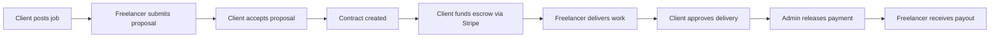

Skillhouse is a full-stack freelance marketplace platform that connects clients who need work done with freelancers who have the skills to do it. Built on the MERN stack, it handles the entire project lifecycle — from posting a job to releasing payment — within a single, secure platform.

## User roles

Skillhouse has three distinct roles, each with its own dashboard and set of capabilities.

<CardGroup cols={3}>
  <Card title="Freelancer" icon="user" href="/roles/freelancer">
    Browse open jobs, submit proposals, manage contracts, deliver work, and receive payments through the escrow wallet.
  </Card>
  <Card title="Client" icon="briefcase" href="/roles/client">
    Post jobs, review proposals, hire freelancers, fund escrow, approve completed work, and leave reviews.
  </Card>
  <Card title="Admin" icon="shield" href="/roles/admin">
    Oversee the platform, manage users, verify contract completion, approve payment releases, and monitor revenue.
  </Card>
</CardGroup>

## Escrow payment model

Skillhouse uses an escrow system to protect both parties in every transaction.

When a client accepts a proposal and creates a contract, they pay the agreed amount upfront via Stripe. That payment is held in escrow — it is not sent to the freelancer until the work is complete and verified. Once the freelancer delivers and the client approves, the admin reviews the contract and releases the funds to the freelancer's wallet.

This three-step release process (client approval → admin verification → payout) ensures that:

- Clients only pay for work they are satisfied with
- Freelancers are guaranteed payment once work is accepted
- The platform can mediate any disputes before funds change hands

<Info>
  Stripe webhooks handle all payment events. Funds held in escrow are tracked in the platform's internal wallet system, separate from Stripe balances.
</Info>

## Core platform workflow

The full lifecycle from job post to payout:

1. **Post a job** — clients describe the work, set a budget, and tag required skills
2. **Apply** — freelancers browse open jobs and submit proposals with a cover letter and proposed rate
3. **Contract** — when a client accepts a proposal, a contract is automatically created for both parties
4. **Escrow** — the client pays through Stripe; funds are held securely until work is complete
5. **Deliver** — the freelancer completes the work and marks the contract as delivered
6. **Approve** — the client reviews the delivery and approves the payment release
7. **Payout** — the admin confirms and releases the payment to the freelancer's wallet

## Explore Skillhouse

<CardGroup cols={2}>
  <Card title="Quick start" icon="rocket" href="/quickstart">
    Get up and running on Skillhouse in minutes, whether you are a freelancer or a client.
  </Card>
  <Card title="Authentication" icon="lock" href="/features/authentication">
    Email/password and Google OAuth sign-in, OTP email verification, and JWT session management.
  </Card>
  <Card title="Jobs and proposals" icon="file-text" href="/features/jobs-and-proposals">
    How job postings, proposals, and the offer workflow operate end to end.
  </Card>
  <Card title="Contracts" icon="file-signature" href="/features/contracts">
    Contract lifecycle from creation through delivery and closure.
  </Card>
  <Card title="Payments and escrow" icon="credit-card" href="/features/payments-and-escrow">
    Stripe integration, escrow wallet mechanics, refunds, and webhooks.
  </Card>
  <Card title="Chat" icon="message" href="/features/chat">
    Real-time messaging between clients and freelancers powered by Socket.io.
  </Card>
</CardGroup>
